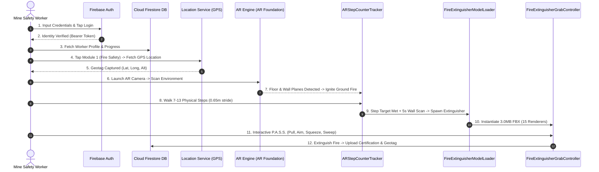

# 🛡️ MiningSafetyAR — Presentation-Level Technical Stack & Architecture Workflow

> **Executive Overview**  
> **MiningSafetyAR** is an enterprise-grade Augmented Reality (AR) spatial computing platform engineered for industrial underground and surface mining compliance. Built on **Unity 6 (6000.3)** and powered by **Firebase Cloud Infrastructure**, the application combines real-time 6-DOF motion tracking, physical stride step-counting, PBR 3D model rendering, and interactive P.A.S.S. fire suppression simulation.

---

## 1. Core Technology Stack & Strategic Decisions

```
+-----------------------------------------------------------------------------------+
|                                  USER INTERFACE                                   |
|   Unity UI (uGUI)  |  PageController Architecture  |  PageTransitionAnimator   |
+-----------------------------------------------------------------------------------+
                                         │
                                         ▼
+-----------------------------------------------------------------------------------+
|                                  AR SPATIAL COMPUTING                             |
|  AR Foundation 6.3  |  ARCore (Android)  |  ARKit (iOS)  |  6-DOF Motion Tracking|
+-----------------------------------------------------------------------------------+
                                         │
                                         ▼
+-----------------------------------------------------------------------------------+
|                             GRAPHICS & SIMULATION ENGINE                          |
|   Universal Render Pipeline (URP)  |  3.0MB FBX PBR Models  |  Particle Foam      |
+-----------------------------------------------------------------------------------+
                                         │
                                         ▼
+-----------------------------------------------------------------------------------+
|                               CLOUD & SECURITY LAYER                              |
|   Firebase Authentication  |  Firestore NoSQL DB  |  Offline JSON Caching     |
+-----------------------------------------------------------------------------------+
```

### 1.1 Why Unity 6 (`6000.3.23f1`)?

| Feature / Criteria | Strategic Advantage in MiningSafetyAR |
|---|---|
| **Ecosystem Maturity** | Unity possesses the most robust spatial computing framework in the industry. |
| **AR Foundation 6.3** | Provides a unified C# API (`com.unity.xr.arfoundation`) abstraction layer over Google ARCore (Android) and Apple ARKit (iOS). |
| **6-DOF Camera Motion Tracking** | Calculates sub-millimeter camera position and orientation deltas in real-time, enabling physical walking step tracking without external sensors. |
| **Universal Render Pipeline (URP 17.3)** | Delivers high-framerate (60+ FPS) PBR (Physically Based Rendering) graphics on mobile chipsets with low battery consumption and zero latency. |
| **Cross-Platform Single Codebase** | Allows rapid deployment to Android mobile/rugged handhelds, iOS, and head-mounted spatial displays (VisionOS). |

---

### 1.2 Why Firebase as the Cloud Service Infrastructure?

| Service | Architecture & Purpose | Strategic Reasons |
|---|---|---|
| **Firebase Authentication** | `FirebaseAuthManager.cs` | Secure credential verification (Email/Password, Token-based) with encrypted TLS transport. Guarantees that only authorized mine personnel access regulatory safety training. |
| **Cloud Firestore (NoSQL DB)** | `FirestoreService.cs` | Real-time database for worker profiles (`WorkerData.cs`), training module scores (`LocalScoreManager.cs`), location geotags, and digital certificates (`CertificateData.cs`). |
| **Offline-First Architecture** | `AppDataService.cs` + `CloudSyncManager.cs` | Underground mining shafts often lack network connectivity. All progress is cached locally in structured JSON and automatically synchronized to Firebase Cloud as soon as network connection is restored. |

---

## 2. Comprehensive End-to-End Application Workflow



---

## 3. Step-by-Step Technical Deep Dive

### Phase 1: Authentication & Credential Verification
1. Worker opens the app; `SplashPageController.cs` initializes core systems.
2. `LoginPageController.cs` presents the security login interface.
3. User enters credentials and taps **Sign In**.
4. `FirebaseAuthManager.cs` sends credentials to **Firebase Authentication**.
5. Upon successful verification:
   - `FirestoreService.cs` fetches the worker profile (`WorkerData.cs`).
   - `NavigationManager.cs` performs a smooth page transition to the **Dashboard**.

---

### Phase 2: Main Dashboard & Module Selection
1. `DashboardPageController.cs` displays active training metrics, completed safety modules, and certifications.
2. `ModulesController.cs` presents the interactive training catalog:
   - **Module 1:** Fire Safety & Extinguisher P.A.S.S. Training
   - **Module 2:** Gas Leak Detection & Atmospheric Hazards
   - **Module 3:** Equipment & Structural Safety Inspection

---

### Phase 3: Module 1 Selected — Location Service & Geotagging
1. When the worker taps **Module 1 (Fire Safety AR)**:
2. The application triggers `TrainingLocationCapture.cs` and `LocationMonitor.cs` using native device GPS / Location Services.
3. **Why Location Fetching?**
   - **Regulatory Compliance & Auditability:** Verifies that safety training took place at an approved site or mine facility.
   - **Geotagged Incident Logs:** Captures latitude, longitude, altitude, and timestamp, attaching them to the final certificate stored in Firebase.

---

### Phase 4: AR Initialization & Plane Detection
1. `AndroidCameraPermissionHelper.cs` verifies camera hardware permissions.
2. `ARSession` and `XROrigin` spin up 6-DOF tracking.
3. `ARPlaneManager` detects surfaces:
   - **Horizontal Planes:** Ground surfaces for fire ignition.
   - **Vertical Planes:** Wall surfaces for mounting safety equipment.
4. `GroundFireController.cs` ignites an animated 3D fire hazard on the detected ground plane, triggering emergency alarms and voice narration (`ARNarrationController.cs`).

---

### Phase 5: Physical Step Counter & 15-Step Emergency Search
1. Emergency search phase starts via **[ARStepCounterTracker.cs](file:///Users/kavin/Development/MiningSafetyAR/Assets/Scripts/AR/ARStepCounterTracker.cs)**.
2. **Physical Stride Calculation:**
   - Tracks 6-DOF camera position deltas in 3D space (`0.65m` average human stride length per step).
   - Requires worker to physically walk 7–13 steps searching the facility.
3. **5-Second Wall Scan:**
   - Once target steps are reached, a 5-second scan evaluates vertical wall planes.
   - If a wall is detected, the extinguisher mounts on the wall; otherwise, it places front-and-center on the floor.

---

### Phase 6: 3D FBX Equipment Spawning & PBR Rendering
1. **[FireExtinguisherModelLoader.cs](file:///Users/kavin/Development/MiningSafetyAR/Assets/Scripts/AR/FireExtinguisherModelLoader.cs)** loads `Assets/Resources/Models/FireExtinguisher.fbx` (3.0MB optimized asset).
2. Spawns 15 distinct sub-mesh renderers:
   - `Body`, `Carry_Handle`, `Squeeze_Lever`, `Upper_Handle_Grip`, `Lever_Pivot`, `Pin_Pull_Ring`, `Pin_Prong_A`, `Pin_Prong_B`, `Hose`, `Gauge_Dial`, `Gauge_Rim`, `Valve_Body`, `Base_Ring`, `Label_Warning`, `Label_Instructions`.
3. Applies Universal Render Pipeline (URP) PBR Lit materials (`FireExtinguisher_Metal_BaseColor.mat` & `FireExtinguisher_Rubber_and_Plastic_BaseCo.mat`).
4. Pre-scales asset to ~0.68m height and applies a 180° rotation correction facing the instruction label forward.

---

### Phase 7: Interactive P.A.S.S. Suppression Engine
**[FireExtinguisherGrabController.cs](file:///Users/kavin/Development/MiningSafetyAR/Assets/Scripts/AR/FireExtinguisherGrabController.cs)** handles first-person AR interaction:

| P.A.S.S. Step | Action | Interaction Logic & Mesh Animation |
|---|---|---|
| **P (Pull Pin)** | Pull Safety Pin | User touches & swipes `Carry_Handle` / `Pin_Pull_Ring`. The pin slides out along the swipe vector; finger release triggers physics drop (`Rigidbody`). |
| **A (Aim Nozzle)** | Aim at Base of Fire | User directs AR camera / nozzle pointer at the ground fire base. |
| **S (Squeeze)** | Squeeze Handle | User touches & holds `Upper_Handle_Grip` / `Lever_Pivot`. Handles animate downward and foam particle stream fires (`ParticleSystem`). |
| **S (Sweep)** | Sweep Side-to-Side | User sweeps foam stream across `GroundFireController.cs` hitboxes, extinguishing the fire. |

---

### Phase 8: Assessment, Certification & Firebase Cloud Sync
1. `AssessmentEngine.cs` evaluates performance based on time, P.A.S.S. accuracy, and step count.
2. `CertificateGenerator.cs` builds a digital compliance certificate with worker ID and GPS location.
3. `CloudSyncManager.cs` uploads score, completion timestamp, and certificate record to **Firebase Cloud Firestore**.

---

## 4. Summary Table of Core Technical Components

| Component Module | File Path | Responsibilities |
|---|---|---|
| **Firebase Auth** | `Assets/Scripts/Firebase/FirebaseAuthManager.cs` | User credential authentication & token management |
| **Firestore Database** | `Assets/Scripts/Firebase/FirestoreService.cs` | Cloud storage for scores, profiles, and certificates |
| **Location Monitor** | `Assets/Scripts/Data/TrainingLocationCapture.cs` | GPS coordinate fetching & compliance geotagging |
| **AR Placement** | `Assets/Scripts/AR/ARPlacementManager.cs` | Plane detection & AR positioning |
| **Step Tracker** | `Assets/Scripts/AR/ARStepCounterTracker.cs` | Physical 6-DOF stride tracking & 5s wall scan |
| **FBX Model Loader** | `Assets/Scripts/AR/FireExtinguisherModelLoader.cs` | 3.0MB FBX model loading & URP PBR material binding |
| **P.A.S.S. Grab Rig** | `Assets/Scripts/AR/FireExtinguisherGrabController.cs` | 1st-person rig, pin swipe, handle press & foam emission |
| **Fire Hazard Engine**| `Assets/Scripts/Modules/GroundFireController.cs` | Animated fire hazard, suppression math & particle raycasts |
